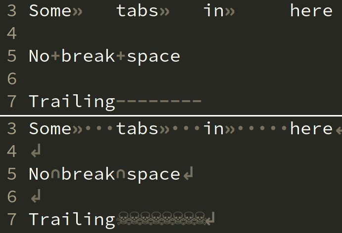

# wheelist.nvim
Define and cylce through multiple `'listchars'` presets, inspired by [cyclist.vim](https://github.com/tjdevries/cyclist.vim)

For more on `'listchars'` see `:help listchars`.



# Configuration
```vim
lua <<EOF
-- Add minimal listchars (true as the final parameter means use defaults for other values)
require'wheelist'.add_listchars('minimal', { tab = '» ' }, true)

-- Add unicode heavy listchars
require'wheelist'.add_listchars('heavy', {
    eol = '↲',
    tab = '»·',
    space = '␣',
    trail = '☠',
    extends = '☛',
    precedes = '☚',
    nbsp = '∩',
})

-- Activate preset
require'wheelist'.activate_listchars'minimal'
EOF

" Add mappings for cycling listchars
nmap <Leader>cp <Plug>WheelistPrev
nmap <Leader>cn <Plug>WheelistNext
```

# Cycling
To cycle through presets use `:lua require'wheelist'.next_listchars()` and
`:lua require'wheelist'.prev_listchars()`. You can also add mappings to
`<Plug>WheelistNext` and `<Plug>WheelistPrev`.


# Dynamically change preset
To modify presets at runtime use `:lua require'wheelist'.set_eol('preset', '$')`,
where `eol` can be replaced by any other listchar. Omitting the second argument will
remove the listchar.


